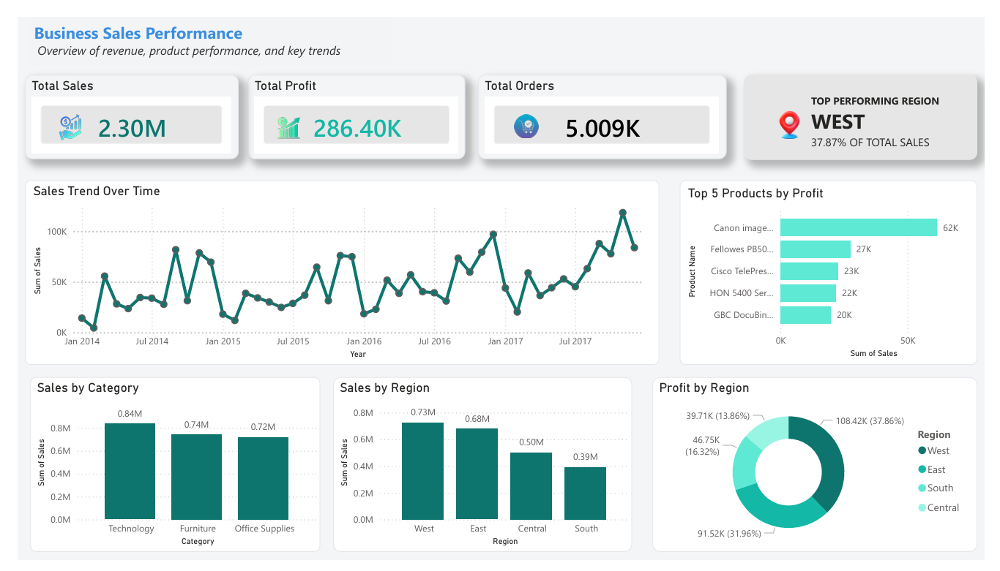

# 📊 Business Sales Performance Analytics Dashboard

## 🚀 Project Overview

This project analyzes business sales data to uncover key insights into revenue trends, product performance, and regional profitability.

The goal is to simulate a real-world business scenario where data is used to support decision-making and growth strategies.

---

## 📌 Dashboard Highlights

* Total Sales: 2.30M
* Total Profit: 286.40K
* Total Orders: 5,009
* Sales Trend Over Time
* Top 5 Products by Profit
* Sales by Category
* Sales & Profit by Region

---

## 🛠️ Tools & Technologies

* Power BI
* Microsoft Excel
* Data Cleaning
* Data Visualization
* Dashboard Design

---

## 📈 Key Insights

* The West region is the top-performing region, contributing ~38% of total sales
* Technology is the highest-performing category in terms of revenue
* A small number of products generate a large portion of total profit
* Sales trends fluctuate over time, indicating possible seasonality
* Some regions underperform, highlighting growth opportunities

---

## 💡 Business Recommendations

* Focus marketing efforts on high-performing regions like the West
* Increase promotion of top-performing products
* Investigate underperforming regions for improvement opportunities
* Use sales trends to plan for seasonal demand

---

## 📷 Dashboard Preview

---

## 🔗 Project Files

* Power BI Dashboard File (.pbix)
* Dataset (Excel/CSV)
* Project Documentation

---

## 🧠 Learning Outcomes

* Improved data cleaning and preparation skills
* Built interactive dashboards using Power BI
* Translated data into actionable business insights
* Developed business thinking using analytics

---
